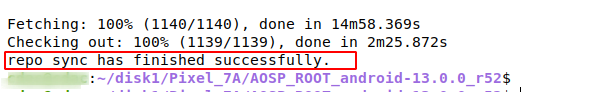
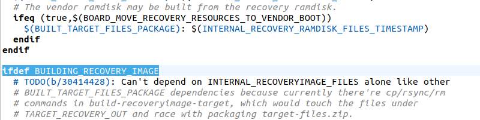
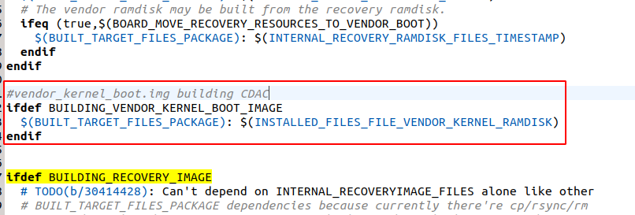

# PIXEL 7A

* ***Building And Flashing AOSP for Pixel 7A (Lynx)***

## Preparing The Environment

* We need to keep our packages up to date to avoid errors due to older ones.

```cmd
sudo apt update
sudo apt upgrade
```

## Installing Necessary Tools

* To build and flash our device we need some tools to convert source code into binary file for that we need to execute the below command.

```cmd
sudo apt install openssh-server screen python git openjdk-8-jdk android-tools-adb bc bison build-essential \
curl flex g++-multilib gcc-multilib gnupg gperf imagemagick lib32ncurses-dev lib32readline-dev lib32z1-dev \
liblz4-tool libncurses5-dev libsdl1.2-dev libssl-dev libxml2 libxml2-utils lzop pngcrush rsync schedtool \
squashfs-tools xsltproc yasm zip zlib1g-dev libtinfo5 libncurses5
```

## Downloading and setting the Repo Tool

* When we download Android source code from google, it has hundreds of git repositories. We need to handle those files for that we need a tool called repo tool, to download and set the path execute the following code.

```cmd
sudo wget 'https://storage.googleapis.com/git-repo-downloads/repo' -P /usr/local/sbin/
```

```cmd
sudo chmod a+x /usr/local/sbin/repo
```

* We can test the repo tool by typing  ***repo*** . If we get the following, it should work.

!!! new "" 
    error: repo is not installed.  Use "repo init" to install it here.

## Configure the git tools

* Now we need to Configure the git tools by executing following commands

```cmd
git config --global user.email "you@example.com"
```

```cmd
git config --global user.name "Your Name"
```

## Downloading the AOSP source code.

* Create a folder in our system and download the aosp source code in it.
* Make a note of the branch and build the id of the device which we want to build and flash.
  * Build Information for Pixel 7A (Lynx)
  * Branch : ***TQ3A.230805.001***
  * Build TAG: ***android-13.0.0_r67***

    For Code Names and branches see here [CodeNames](https://source.android.com/setup/start/build-numbers).

    For device specific vendor binaries see here [DriverBinaries](https://developers.google.com/android/drivers#lynxtq3a.230805.001).

* To create folder enter the following commands in terminal

```cmd
mkdir ~/AOSP_Root
```

* To change the directory from current directory

```cmd
cd ~/AOSP_Root
```

* This command will initialize the sources that are required for the branch mentioned after the b tag.

```cmd
repo init -u https://android.googlesource.com/platform/manifest -b android-13.0.0_r67
```

* If you are concern about space then use the following command with additional parameter ***"--depth=1"***

```cmd
repo init -u https://android.googlesource.com/platform/manifest -b android-13.0.0_r67 --depth=1
```

* By executing the following command you can download the source code

```cmd
repo sync -j30
```

<!-- <span style="color:Red">NOTE:</span> ***The above command will take significant time depends upon the Internet speed and system configuration.*** -->
!!! info "<span style="color:Red">*NOTE*</span>"
    ***The above command will take significant time depends upon the Internet speed and system configuration.***

* After the above command executed successfully following message will appear on the console.

<!-- { align=center } -->
<figure markdown>
  
  <figcaption><b>Repo Sync done</b></figcaption>
</figure>

* After downloading the source code you need to download the Device specific vendor binaries From here [DriverBinaries](https://dl.google.com/dl/android/aosp/google_devices-lynx-tq3a.230805.001-ce153214.tgz) and download the correct binary file using build id and branch.

* After downloading Binaries Place them in the ***AOSP_Root/*** directory and extract the tar zip file using the following command.

```cmd
tar -xzf google_devices-lynx-tq3a.230805.001-ce153214.tgz
```

* After extracting the above file you will get on shell script file named ***extract-google_devices-lynx.sh***. execute the script file using following command.

```cmd
./extract-google_devices-lynx.sh
```

* While executing these file, you need to type **I ACCEPT** when prompted in order to execute these successfully.

Now successfully downloaded the full source code now we need to Build the source code.

## Building the AOSP Source Code

<!-- <span style="color:Red">NOTE:</span> ***Before executing below commands make sure you are in*** **AOSP_Root/** ***Directory.*** -->
!!! info "<span style="color:Red">*NOTE*</span>"
    Before executing below commands make sure you are in ***AOSP_Root/*** Directory.

* By executing following command all essential definitions provided by envsetup.sh are loaded into the current shell.

```cmd
source build/envsetup.sh
```

* Now you need to execute the following command to select the device specific build target.

```cmd
lunch
```

* The above command will show the list of avialable devices build targets you need to select your device specific target by typing corresponding number or name of the target ( in my case it is ***aosp_lynx-userdebug*** )

```cmd
aosp_lynx-userdebug
```

!!! info "<span style="color:Red">*NOTE*</span>"
    <span style="color:green"> ***do the below changes Specific to my branch and device***</span>
<!-- <span style="color:Red">**NOTE:**</span>  <span style="color:green"> ***do the below changes particular to my branch and device***</span> -->

<!-- * After lunch command execute the following command to build **otatools** which are required to build and package the flashable zip file.

```cmd
make otatools -j20
``` -->

* After above command you need to modify the following file to build the **vendor_kernel_boot.img** image file which is required in android 12 builds, but the target line is missing in my device's specific branch source code.

* File Path: **AOSP_Root/build/make/core/Makefile**
* to open that file use the below commands in **AOSP_Root/** Terminal.

```cmd
cd build/make/core
```

```cmd
gedit Makefile
```

* Once you opened the above file identify the line which is highlighted in the below screenshot. (<span style="color:Red">NOTE:</span> ***use "ctrl+f" to search the string.***)

<figure markdown>
  
  <figcaption><b>Before adding vendor_kernel_boot.img</b></figcaption>
</figure>

<!--  -->

* After the identifying the line add the below lines above highlighted text in the screenshot as shown in below screen shot.

```cmd
ifdef BUILDING_VENDOR_KERNEL_BOOT_IMAGE
  $(BUILT_TARGET_FILES_PACKAGE): $(INSTALLED_FILES_FILE_VENDOR_KERNEL_RAMDISK)
endif
```

<figure markdown>
  
  <figcaption><b>After adding vendor_kernel_boot.img</b></figcaption>
</figure>

<!--  -->

* Now goto the Root directory by typing the following command.

```cmd
croot
```

* Now execute the following command to build the source code.

```cmd
make updatepackage -j20
```

!!! info "<span style="color:Red">*NOTE*</span>"
    ***The above command will take significant time depends upon the Internet speed and system configuration.***
<!-- <span style="color:Red">NOTE:</span> ***The above command will take significant time depends upon the Internet speed and system configuration.*** -->

* After successfull completion of building source code you will get flashable zip file in the following path ***out/target/product/lynx/*** file named ***aosp_lynx-img-eng.cdac.zip***.

* The above file you can flash on to the device using **adb and fastboot** tools.

## Flashing The AOSP source code

* To flash you need to Unlock the bootloader of the device

### Flashing the Image file

* To Flash image file executing the below commands in **AOSP_Root/** directory.

```cmd
adb reboot bootloader
```

```cmd
fastboot -w update out/target/product/lynx/aosp_lynx-img-eng.cdac.zip
```

!!! danger "<span style="color:Red">*NOTE*</span>"
    ***Don't Remove your device until the above command executed sucessfully.***
<!-- <span style="color:Red">NOTE:</span> ***Don't Remove your device until the above command executed sucessfully.*** -->

* After successfull completion of above command you will redirect to Homepage of your device of custom ROM.
  