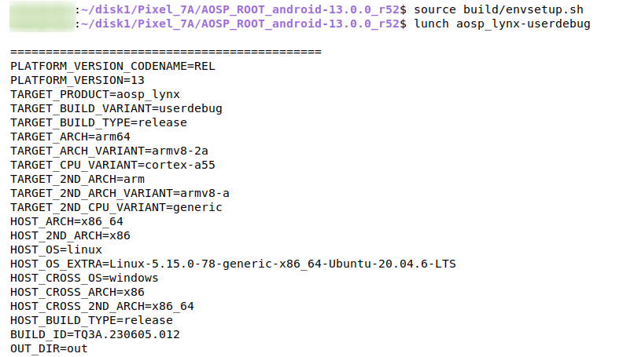

# PIXEL 7A AOSP Kernel(Lynx)
*  ***Building And Flashing AOSP KERNEL for Pixel 7A (Lynx)***


## Objective

The Aosp kernel is to be integrated with our own AOSP build for the operations which can be done with kernel level.

## Downloading Sources with Branch

For downloading the sources for kernel we are using the Repo Tool and Create a directory and change to that directory by using below commands

```cmd
mkdir Kernel_Root/ && cd Kernel_Root/
```

*  Open the **Kernel_Root** directory in the terminal window and initialize the Repo tool in this directory by using following command

For Kernel Branches visit this [google kernel](https://android.googlesource.com/kernel/gs/+/refs/heads/android-gs-lynx-5.10-android13-qpr3).

```cmd
repo init -u https://android.googlesource.com/kernel/manifest -b android-gs-lynx-5.10-android13-qpr3
```

*  After Repo initialization you need to download the source code by using the following command.

```cmd
repo sync -j16
```
<!-- <span style="color:Red">NOTE:</span> ***The above command will take significant time depends upon the Internet speed and system configuration.*** -->
!!! info "<span style="color:Red">*NOTE*</span>"
    ***The above command will take significant time depends upon the Internet speed and system configuration.***

## Changing the Android Kernel Name

<!-- <span style="color:Red">NOTE:</span> ***Execute the all the commands in*** **Kernel_Root/** ***directory.*** -->

!!! info "<span style="color:Red">*NOTE*</span>"
    *Execute the all the commands in* **Kernel_Root/** *directory.*

*  Identify the Following File. ***Kernel_Root/build/build.sh***

```cmd
cd build
gedit build.sh
```
*  After opeining the file find the **-d LTO_CLANG_THIN** and add the below lines after the above line.

!!! new ""
    -d LOCALVERSION_AUTO \

    --set-str LOCALVERSION "--Lynx-PIXEL_7A--" \

<!-- ```
-d LOCALVERSION_AUTO \
--set-str LOCALVERSION "--Lynx-PIXEL_7A--" \
``` -->

## Compiling The Android Kernel
*  To compile the kernel execute the following command.

```cmd 
LTO=full BUILD_AOSP_KERNEL=1 ./build_lynx.sh
```
<!-- <span style="color:Red">NOTE:</span> ***The above command will take significant time depends upon the Internet speed and system configuration.*** -->
!!! info "<span style="color:Red">*NOTE*</span>"
    ***The above command will take significant time depends upon the Internet speed and system configuration.***

## Booting the Kernels

*  After the Successfull Completion of building the kernels the Image files are copied in to the ***out/mixed/dist*** path files named **Image.lz4 and boot.img**

*  You can flash the Kernels by executing the following command from **Kernel_Root** directory.
```cmd
adb reboot bootloader
```

*  below command is used to flash the **Image.lz4** file
```cmd
fastboot boot out/mixed/dist/Image.lz4
```

*  below command is used to flash the **Boot image Partition**
```cmd
fastboot flash boot out/mixed/dist/boot.img
```

*  below command is used to flash the **Vendor Boot image Partition**
```cmd
fastboot flash vendor_boot out/mixed/dist/vendor_boot.img
```

*  below command is used to go into the **Fastboot Mode** 
```cmd
fastboot reboot fastboot
```

*  below command is used to flash the Vendor Lodable Kernel modules 
```cmd
fastboot flash vendor_dlkm out/mixed/dist/vendor_dlkm.img
```

*  Then Reboot the Device by using below command
```cmd
fastboot reboot
```

!!! warning "<span style="color:Red">*NOTE*</span>"
    ***After All Commands executed it is recomended to do Factory Reset of your device.***
<!-- <span style="color:Red">*NOTE:</span> After All Commands executed it is recomended to do Factory Reset of your device.* -->


## Embedding Kernel Image File into AOSP source Code

### Initializing the **AOSP_Root**

*  Open the **AOSP_ROOT** directory in Terminal and Execute the following commands
```cmd
cd AOSP_ROOT/

source build/envsetup.sh

lunch
```

*  **lunch** command will list out all the available devices targets, you need to select the the device which your building for. (In my case it is Pixel 7a (Lynx)),so i will select **aosp_lynx-userdebug**.
<figure markdown>
  
  <figcaption><b>Pixel 7A lunch menu</b></figcaption>
</figure>

### Copying Kernel Image files to AOSP
*  Now copy all files in **Kernel_Root/out/mixed/dist/** to the **AOSP_Root/device/google/lynx-kernel/** directory.

<!-- <span style="color:Red">*NOTE:</span> Before copying all files take the backup of all files for in future if you want to revert back the changes.* -->
!!! info "<span style="color:Red">*NOTE*</span>"
    ***Before copying all files take the backup of all files for in future if you want to revert back the changes.***

#### changing the Prebuilt boot image path

* Identify the file named **BoardConfig-common.mk** in the path **AOSP_Root/device/google/gs201/** open the file and identify the following lines in the file

!!! new ""
    ==BOARD_PREBUILT_BOOTIMAGE := $(wildcard $(TARGET_KERNEL_DIR)/boot.img)==

    ==ifneq (,$(BOARD_PREBUILT_BOOTIMAGE))==

    ==TARGET_NO_KERNEL := true==

    ==else==

    TARGET_NO_KERNEL := false

    ==endif==

Delete the Highlighted lines from the file and save the file and close it after deleting the file look like.
<!-- except the bold line delete everything after deleting the above lines except bold it's look like -->

!!! new ""
    **TARGET_NO_KERNEL := false**

*  by doing above change it won't refere to **prebuilt boot.img** instead it will create with our own **boot.img**

### Building The AOSP Image file with Kernel
*  Now execute the following command to build the new AOSP build Image.
```cmd
make updatepackage -j16
```
*  With above command new AOSP Build Image is created in the following path **AOSP_Root/out/target/product/lynx/**  with file name **aosp_lynx-img-eng.cdac.zip** .The zip can flashed on to the mobile.

### Flashing AOSP Image Files to the Device.
To flash the AOSP Images Execute the following commands in **AOSP_Root/** directory.

*  To go into Bootloader mode execute the following command
```cmd
adb reboot bootloader
```

*  To flash the AOSP Image files execute the following command.
```cmd
fastboot -w update out/target/product/lynx/aosp_lynx-img-eng.cdac.zip
```


## Verification

*  to verify the Kernel is flashed or not connect the device to host system and execute the following commands in the terminal.

```cmd
adb shell
```
now you will be in the shell of your device and then type your command without **$** symbol.
```cmd
 uname -a
```

it will display the Kernel version string with your kernel name and version as shown below.

!!! new ""
    ==**Linux version 5.10.157--Lynx-PIXEL7A-+**==
